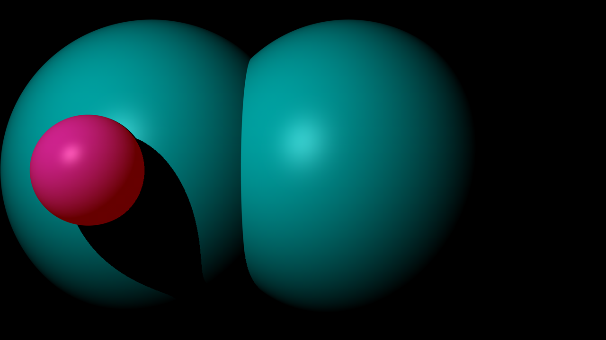
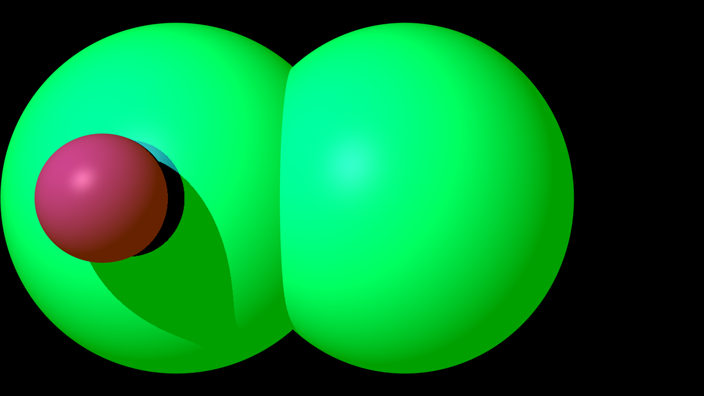
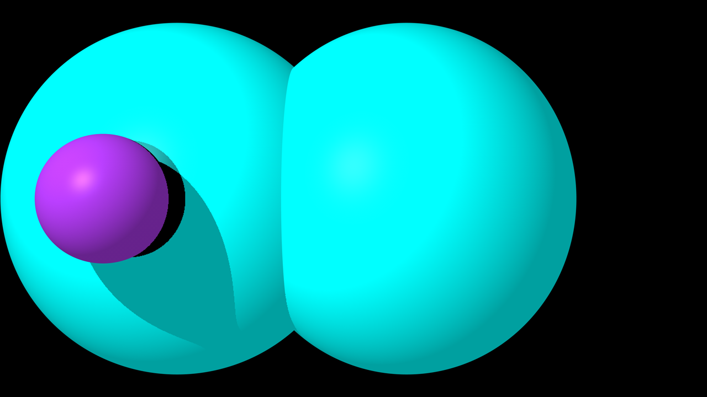
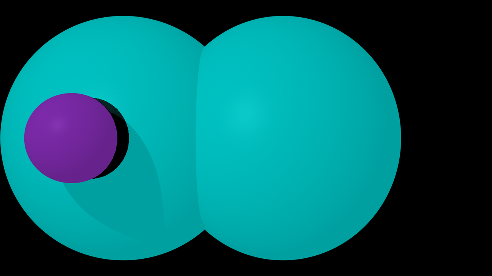
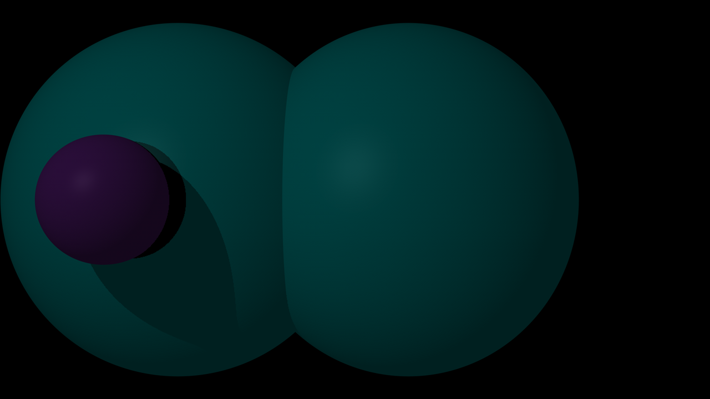
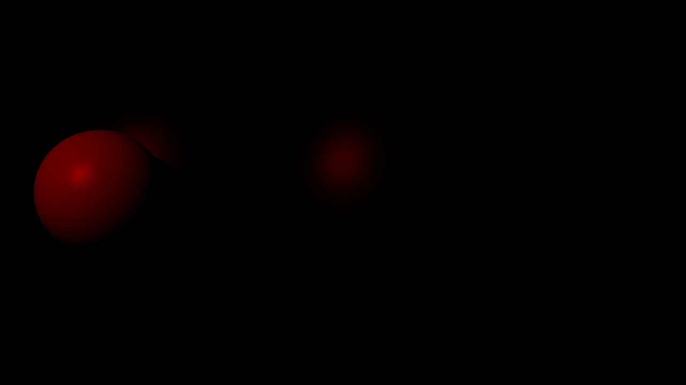
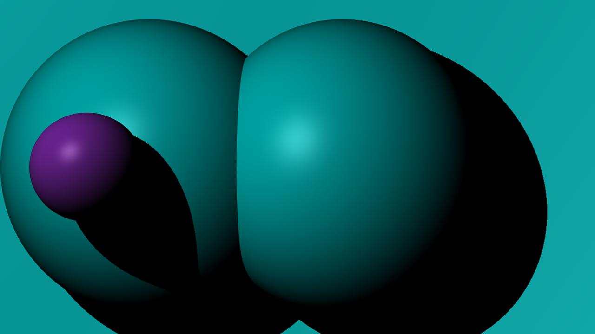
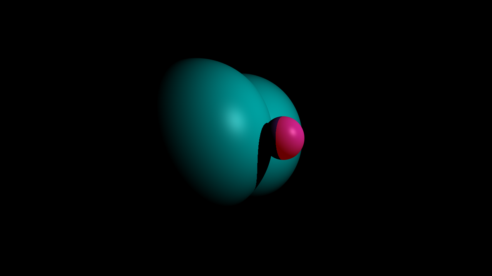

# MiniRT_tester

All render are done with [Cinema4D of Maxon](https://www.maxon.net/cinema-4d).


<details>
  <summary>Don't forget that you can use the table of content of GITHUB.</summary>
  
  
  
</details>
 
## Simple test with sphere

### Render 1

3 spheres, with white light and no ambiantlight.


```
canvas        height 720, width 1280
ambiantlight  coef 0.00, rgb(255,0,0)
camera        pos(400.00;0.00;0.00), rot(0.00;0.00;0.00), fov 60
light         pos(250.00;100.00;50.00), coef 1.00, rgb(255,255,255)
sphere        pos(300.00;0.00;346.41), diameter 200.00, rgb(0,200,200)
sphere        pos(300.00;0.00;226.41), diameter 50.00, rgb(128,43,175)
sphere        pos(430.00;0.00;346.41), diameter 200.00, rgb(0,200,200)
```

### Render 2



3 spheres, with white light and red ambiantlight.

```
canvas        height 720, width 1280
ambiantlight  coef 1.00, rgb(255,0,0)
camera        pos(400.00;0.00;0.00), rot(0.00;0.00;0.00), fov 60
light         pos(250.00;100.00;50.00), coef 1.00, rgb(255,255,255)
sphere        pos(300.00;0.00;346.41), diameter 200.00, rgb(0,200,200)
sphere        pos(300.00;0.00;226.41), diameter 50.00, rgb(128,43,175)
sphere        pos(430.00;0.00;346.41), diameter 200.00, rgb(0,200,200)
```

### Render 3



3 spheres, with white light and yellow ambiantlight.

```
canvas        height 720, width 1280
ambiantlight  coef 1.00, rgb(255,255,0)
camera        pos(400.00;0.00;0.00), rot(0.00;0.00;0.00), fov 60
light         pos(250.00;100.00;50.00), coef 1.00, rgb(255,255,255)
sphere        pos(300.00;0.00;346.41), diameter 200.00, rgb(0,200,200)
sphere        pos(300.00;0.00;226.41), diameter 50.00, rgb(128,43,175)
sphere        pos(430.00;0.00;346.41), diameter 200.00, rgb(0,200,200)
```

### Render 4



3 spheres, with white light and white ambiantlight.

```
canvas        height 720, width 1280
ambiantlight  coef 1.00, rgb(255,255,255)
camera        pos(400.00;0.00;0.00), rot(0.00;0.00;0.00), fov 60
light         pos(250.00;100.00;50.00), coef 1.00, rgb(255,255,255)
sphere        pos(300.00;0.00;346.41), diameter 200.00, rgb(0,200,200)
sphere        pos(300.00;0.00;226.41), diameter 50.00, rgb(128,43,175)
sphere        pos(430.00;0.00;346.41), diameter 200.00, rgb(0,200,200)
```

### Render 5



3 spheres, with white light coef 20% and white ambiantlight.

```
canvas        height 720, width 1280
ambiantlight  coef 1.00, rgb(255,255,255)
camera        pos(400.00;0.00;0.00), rot(0.00;0.00;0.00), fov 60
light         pos(250.00;100.00;50.00), coef 0.20, rgb(255,255,255)
sphere        pos(300.00;0.00;346.41), diameter 200.00, rgb(0,200,200)
sphere        pos(300.00;0.00;226.41), diameter 50.00, rgb(128,43,175)
sphere        pos(430.00;0.00;346.41), diameter 200.00, rgb(0,200,200)
```

### Render 6



3 spheres, with white light coef 20% and white ambiantlight 20%.

```
canvas        height 720, width 1280
ambiantlight  coef 0.20, rgb(255,255,255)
camera        pos(400.00;0.00;0.00), rot(0.00;0.00;0.00), fov 60
light         pos(250.00;100.00;50.00), coef 0.20, rgb(255,255,255)
sphere        pos(300.00;0.00;346.41), diameter 200.00, rgb(0,200,200)
sphere        pos(300.00;0.00;226.41), diameter 50.00, rgb(128,43,175)
sphere        pos(430.00;0.00;346.41), diameter 200.00, rgb(0,200,200)
```

### Render 7



3 spheres, with red light and no ambiantlight.

```
canvas        height 720, width 1280
ambiantlight  coef 0.00, rgb(255,255,255)
camera        pos(400.00;0.00;0.00), rot(0.00;0.00;0.00), fov 60
light         pos(250.00;100.00;50.00), coef 1.00, rgb(255,0,0)
sphere        pos(300.00;0.00;346.41), diameter 200.00, rgb(0,200,200)
sphere        pos(300.00;0.00;226.41), diameter 50.00, rgb(128,43,175)
sphere        pos(430.00;0.00;346.41), diameter 200.00, rgb(0,200,200)
```

### Render 8



4 spheres, the first scene is in the (4th) big sphere, with white light and no ambiantlight.

```
canvas        height 720, width 1280
ambiantlight  coef 0.00, rgb(255,0,0)
camera        pos(400.00;0.00;0.00), rot(0.00;0.00;0.00), fov 60
light         pos(250.00;100.00;50.00), coef 1.00, rgb(255,255,255)
sphere        pos(300.00;0.00;346.41), diameter 200.00, rgb(0,200,200)
sphere        pos(300.00;0.00;226.41), diameter 50.00, rgb(128,43,175)
sphere        pos(430.00;0.00;346.41), diameter 200.00, rgb(0,200,200)
sphere        pos(400.00;0.00;0.00), diameter 800.00, rgb(0,200,200)
```

### Render 9



Same scene that the first but with rotation.

```
canvas        height 720, width 1280
ambiantlight  coef 1.00, rgb(255,0,0)
camera        pos(-140.00;0.00;70.00), rot(0.00;64.80;0.00), fov 60
light         pos(250.00;100.00;50.00), coef 1.00, rgb(255,255,255)
sphere        pos(300.00;0.00;346.41), diameter 200.00, rgb(0,200,200)
sphere        pos(300.00;0.00;226.41), diameter 50.00, rgb(128,43,175)
sphere        pos(430.00;0.00;346.41), diameter 200.00, rgb(0,200,200)
```
